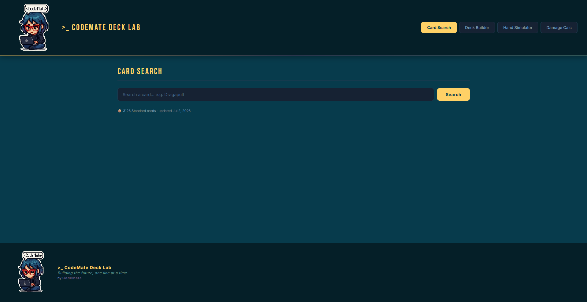
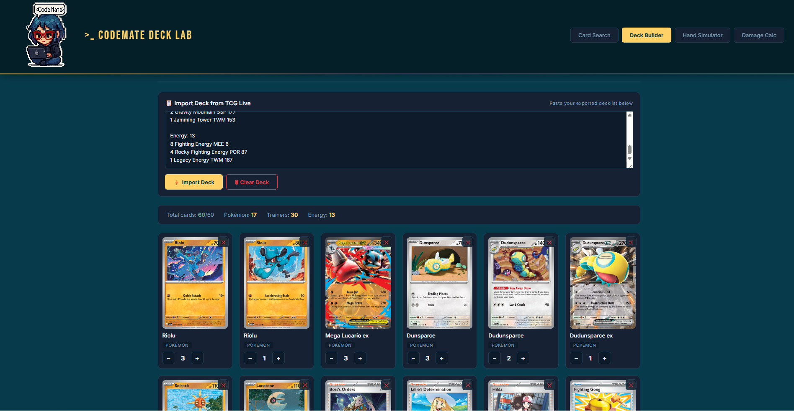
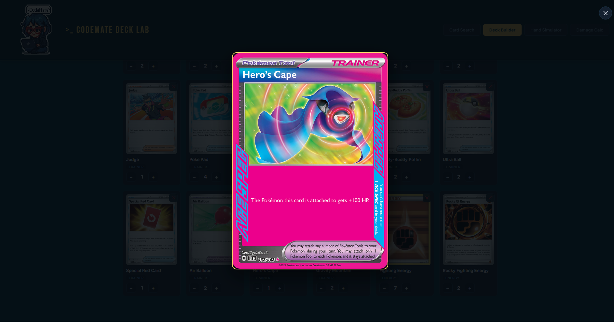
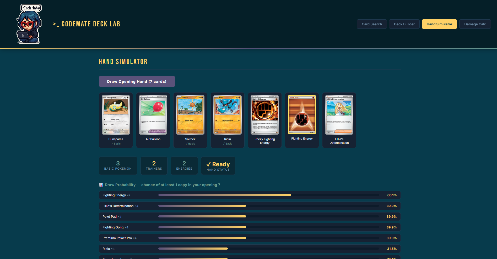
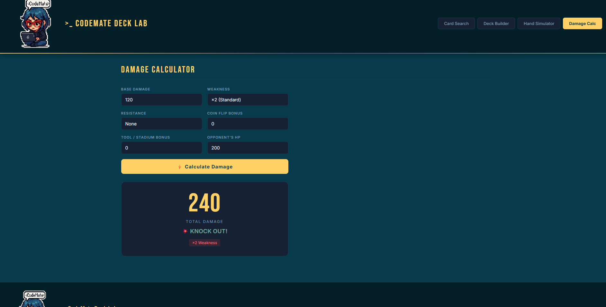

# >_ CodeMate Deck Lab

> A Pokémon TCG Standard-format toolkit built with pure HTML, CSS and vanilla JavaScript — no frameworks, no libraries. Made by a self-taught junior developer, for the Pokémon TCG community.


---

## 🎴 Live Demo

👉 **[devCODEMATE.github.io/codemate-deck-lab](https://devCODEMATE.github.io/codemate-deck-lab/)**

---

## 📸 Screenshots

| Card Search | Deck Builder |
|---|---|
|  |  |

| Card Zoom | Hand Simulator + Draw Probability |
|---|---|
|  |  |

**Damage Calculator**



---

## 📖 About the Project

CodeMate Deck Lab is a free toolkit for the Pokémon TCG Standard format: search cards, build a 60-card deck, simulate opening hands with real draw probability, and calculate attack damage — all in one place, no login, no ads, no account needed.

It started as a small deck-builder and grew into something with a real data pipeline behind it: a local card catalog that refreshes itself weekly via GitHub Actions, a three-tier fallback system for card art, and support for importing decklists from both **Pokémon TCG Live** and **Limitless TCG**, which — it turns out — format their exports differently in ways that aren't obvious until you're debugging them at midnight.

This project is fan-made, non-commercial, and built purely for learning and for the love of the Pokémon TCG community.

---

## ✨ Features

### 🔍 Card Search
- Search any Standard-legal card (regulation marks H, I, J) by name
- Backed by a **local catalog of 3,000+ cards** cached from the Pokémon TCG API — search is instant, no waiting on external requests
- Falls back to a live search automatically if a card isn't in the local catalog yet (useful for very recent releases)

### 🃏 Deck Builder
- Grid layout with full-size card art, not a cramped list
- **Import decks from both Pokémon TCG Live and Limitless TCG** — the two major sources players actually copy decklists from, each with its own export quirks that this app detects and handles automatically
- Rule enforcement: max 4 copies per card (except Basic Energy), 60-card limit
- Click any card to zoom — cards without indexed artwork yet show a clearly labeled "coming soon" placeholder instead of a blank or broken image
- Live counter for total cards, Pokémon, Trainers and Energy

### 🎲 Hand Simulator + Draw Probability
- Simulate your opening hand (7 cards) with a Fisher-Yates shuffle for genuinely fair randomization
- Automatic Mulligan detection if there's no Basic Pokémon in hand
- **Draw Probability panel**: real hypergeometric distribution math showing the exact % chance of drawing at least one copy of each card in your deck within your opening 7 — useful for actually comparing consistency between two versions of a deck, not just eyeballing it

### 💥 Damage Calculator
- Weakness (×2, ×1.5, +30), Resistance, Coin Flip and Tool/Stadium bonuses
- Knockout checker showing remaining HP if it's not a KO

---

## 🏗️ How the Data Pipeline Works

This is the part I'm most proud of, so I'm documenting it properly:

```
GitHub Actions (weekly cron)
  → scripts/fetch-cards.js queries the Pokémon TCG API
  → filters by regulation mark H/I/J, plus supplemental queries
    for Basic Energy and promo sets that don't always carry a
    regulation mark
  → retries failed requests with exponential backoff
    (the API is occasionally flaky — this took a while to figure out)
  → writes data/standard-cards.json, but only if the result looks
    complete (a sanity check blocks a partial/broken run from
    overwriting good data)
  → app.js loads this file once on page load and searches it
    in memory — no network round-trip per keystroke
```

When a card isn't in the local catalog (a very recent release, usually), the app falls back to a live search against the Pokémon TCG API, and then to **TCGdex** as a third source if the first one doesn't have it either. Each fallback is logged to the console so the failure mode is always visible, not silent.

---

## 🛠️ Technologies Used

| Technology | Purpose |
|-----------|---------|
| **HTML5** | Semantic structure, `<h1>`/`<nav>`/`aria-*` for accessibility |
| **CSS3** | Grid layout, responsive design, custom properties for theming |
| **Vanilla JavaScript** | All logic — DOM manipulation, async data fetching, regex parsing |
| **Pokémon TCG API** | Primary card data and images |
| **TCGdex** | Secondary fallback source (open source, actively maintained) |
| **GitHub Actions** | Scheduled data pipeline, no server needed |
| **GitHub Pages** | Free static hosting |

---

## 📚 What I Learned Building This

This was my most technically demanding project so far, and it forced me to actually understand things I'd only used at a surface level before.

### Async JavaScript & API integration
- Chaining multiple `async/await` fallback sources cleanly (local → live API → secondary API) without the code turning into a mess of nested callbacks
- `AbortController` and timeouts, so one slow request doesn't freeze the whole import
- Why silently swallowing errors in a `catch` block is a debugging trap — I added explicit `console.warn`/`console.error` logging everywhere a fallback fires, which is what actually let me find the real bugs instead of guessing

### Regex, the hard way
- Parsing real-world decklist text turned out to be much harder than it looks — different export tools format the same information differently (hyphenated set codes like `PR-SV`, energy type shorthand like `{D}`, placeholder codes that aren't real prints)
- Learned to test regex patterns in isolation with Node before assuming they worked, instead of debugging blind inside the full app

### Debugging methodology
- The biggest lesson: when something "should" work but doesn't, add logging and get real data before changing more code. I found and fixed several bugs this way that I would never have guessed correctly otherwise (a classic one: rebuilding a DOM element's `innerHTML` after already attaching an event listener to it silently destroys that listener)
- `node --check` to validate JavaScript syntax before deploying, which caught a broken edit before it ever reached the live site

### Data pipelines & automation
- Building on the same GitHub Actions pattern I used in an earlier project (auto-fetching World Cup 2026 data), applied here to keep a card catalog fresh without a backend or database
- Sanity checks matter: a scheduled job that blindly overwrites good data with a failed run's output is worse than no automation at all

### Accessibility & semantics
- A page needs exactly one `<h1>` — mine didn't have one until I added it
- `aria-current`, `aria-label` on icon-only buttons, and why they're not optional extras

### Debugging infrastructure vs. debugging code
- Learned to tell the difference between "my code is broken" and "GitHub Pages' deploy pipeline is having a bad day" — auditing every file with real tools (`node --check`, an HTML parser, brace-balance checks) before assuming the code was at fault, and confirming the difference before spending more time guessing

---

## 🚀 Getting Started

```bash
git clone https://github.com/devCODEMATE/codemate-deck-lab.git
```

Open `index.html` with a live server (e.g. VS Code's Live Server extension). No build step, no dependencies to install for the app itself.

To run the data pipeline locally:
```bash
node scripts/fetch-cards.js
```
Requires Node 18+ (uses native `fetch`). Set `POKEMONTCG_API_KEY` as an environment variable for higher rate limits — get a free key at [dev.pokemontcg.io](https://dev.pokemontcg.io/).

---

## 📁 Project Structure

```
codemate-deck-lab/
├── index.html
├── style.css
├── app.js
├── data/
│   └── standard-cards.json      # auto-generated, don't edit by hand
├── scripts/
│   └── fetch-cards.js           # the data pipeline script
├── .github/workflows/
│   └── fetch-cards.yml          # weekly cron that runs the pipeline
└── images/
    └── codemate-avatar.png
```

---

## 🎯 Future Improvements

- [ ] Save decks to localStorage
- [ ] Export deck back to TCG Live / Limitless format
- [ ] Card price lookup integration
- [ ] Full historical card collection tracker (separate project in planning)

---

## 👨‍💻 Author

**devCODEMATE** — self-taught junior frontend developer based in Argentina, building a portfolio one honest, fully-debugged project at a time.
- GitHub: [@devCODEMATE](https://github.com/devCODEMATE)

---

## 📄 License & Legal

This project is open source under the [MIT License](LICENSE).

CodeMate Deck Lab is a fan-made project, built for learning purposes and out of love for the Pokémon TCG community. It is not affiliated with, endorsed by, or sponsored by The Pokémon Company, Nintendo, Game Freak or Creatures Inc. Card images and data are provided by the [Pokémon TCG API](https://pokemontcg.io/) and [TCGdex](https://tcgdex.dev/) and remain the property of their respective owners. No card data is sold, and no ads are served on this site.